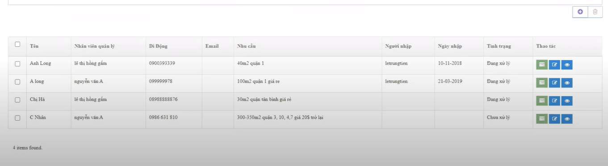
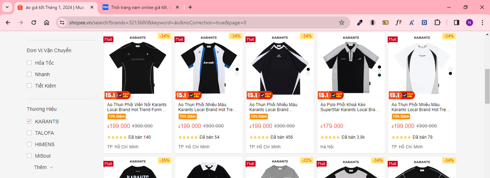
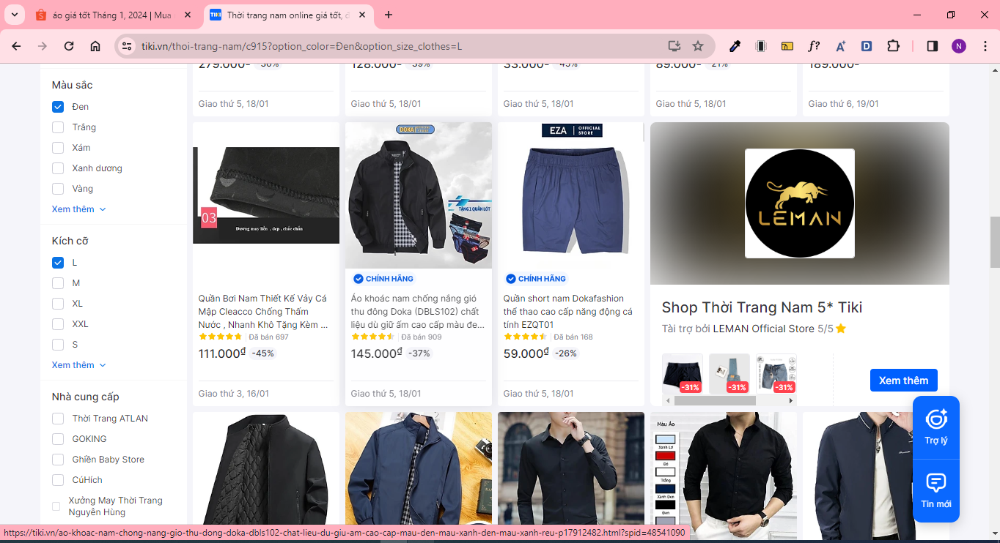

#### Hello các bạn, có lẽ các sàn thương mại điện tử đã không quá xa lạ đối với các bạn. Mỗi lần các bạn mua hoặc tìm kiếm một sản phẩm nào đó thì các bạn có thể thấy rằng mỗi sản phẩm sẽ có các thuộc tính đặc trưng riêng biệt của nó. Ví dụ quần áo: bạn có thể thấy trên shopee đôi lúc bạn thấy nó chỉ có size hoặc màu sắc hoặc có cả hai màu sắc và size. Điện thoại: có ram, dung lượng, màu sắc,... Làm sao để người ta có thể xây dựng cơ sở dữ liệu (database) để lưu sản phẩm sao cho mỗi sản phẩm sẽ có từng thuộc tính, từng giá trị thuộc tính riêng biệt. Thì bài viết này sẽ giúp các bạn hiểu phần nào về câu hỏi trên.

#### Thì đầu tiên mình xin phép được trả lời câu hỏi trên là: mình sẽ xây dựng bằng cách tạo thuộc tính động cho sản phẩm. Còn có rất nhiều kỹ thuật khác, các bạn biết thì có thể comment dưới bài viết nhé, để mình có thể tham khảo và học hỏi thêm.

#### Vậy làm sao để chúng ta có thể xây dựng được thuộc tính động cho sản phẩm? Chúng ta bắt đầu đi tìm hiểu ha!

#### Đầu tiên các bạn vào 1 sản phẩm trên Shopee, Tiki, Lazada, các website bán hàng khác,... Bạn sẽ thấy đó chính là thông tin về sản phẩm. Bao gồm url (link hiển thị trên website), danh mục của sản phẩm (Shopee -> Điện Thoại & Phụ Kiện -> Điện thoại), tên, giá, số lượng, ảnh , mô tả, chi tiết sản phẩm, thuộc tính, thương hiệu,... của sản phẩm. Các bạn bỏ qua phần bình luận nhé. Vì vậy ta sẽ có 1 bảng sản phẩm để lưu và hiển thị thông tin cho người dùng.

#### Table product

```sql
    id
    slug (url)
    name
    price
    quantity
    images
    attributes
    description
    detail
    categories
    brand
    status
    createddate
    createdby
    modifieddate
    modifiedby
    ordering
```

#### 1 sản phẩm sẽ có 1 hoặc rất nhiều ảnh. Thì ta sẽ có 1 bảng là image để chứa hình ảnh của sản phẩm

#### Table image

```sql
    id
    image
    product_id
    status
    createddate
    createdby
    modifieddate
    modifiedby
    ordering
```

#### Data mẫu bảng image

```sql
    id          image           product_id      status          ordering
    1           anh1            1               ACTIVE          1
    2           anh2            1               ACTIVE          2
    3           anh3            1               ACTIVE          1
    4           anh4            1               INACTIVE        1
        ....
```

#### Ý nghĩa của từng field trong bảng image

    1. id: khóa chính giúp các bạn phân biệt với các rows các trong 1 bảng
    2. image: là field chứa tên hình ảnh hoặc url của ảnh mà bạn sẽ lưu trong table image
    3. product_id: là khóa ngoại liên kết tới bảng product, để giúp các bạn lấy được các hình ảnh của sản phẩm thông qua khóa ngoại này
    4. 6 field cuối ha. Bạn có thể thấy 2 bảng mình liệt kê thì bảng nào cũng có 6 field cuối này. Thì mình xin phép giải thích 6 filed này và các bảng sau mình sẽ không giải thích lại và cũng như mình không viết lại vào table nữa mà mình sẽ dùng .... Thì các bạn hiểu là ... đó chính là 6 filed này ha
       1. status: trạng thái của 1 đối tượng nào đó trong database
          - Ví dụ: 1 công ty lưu thông tin các nhân viên. Có 1 nhân viên nào đó nghỉ việc. Thay vì chúng ta xóa hết thông tin của nhân viên thì chúng ta sẽ xóa mềm (chỉ update lại trạng thái là INACTIVE hoặc DELETE). Tại sao không xóa nhân viên đó đi mà chỉ xóa mềm. Thì thưa rằng nếu bạn xóa thông tin nhân viên đó đi, lỡ đâu nó kiện bạn vì trả lương sai. Thì bây giờ bạn lấy thông tin ở đâu để chứng minh rằng bạn trả đúng cho nó vì bạn đã xóa hết thông tin của nhân viên đó rồi. Nên status được thêm vào là như vậy. Và hiện tại thì mình được học, cũng như các anh chỉ bảo thì người ta dùng là dùng xóa mềm (update status)
       2. 4 field createddate, createdby, modifieddate, modifiedby: thì 4 thằng này sẽ giúp bạn hiển thị: thời gian bạn tạo đối tượng đó, ai là người tạo đối tượng đó, thời gian nào để bạn sửa đối tượng đó, ai là người sửa đối tượng đó
          - Tại sao cần 4 thằng này làm chi. Thì sẽ có 1 số trường hợp người ta muốn thấy thời gian tạo ra, người tạo ra đối tượng đó. Case này bạn có thể xem hình ảnh bên dưới
          - Đối với 2 trường modifieddate và modifiedby tương tự tình huống trên
       3. ordering: thứ tự ưu tiên để giúp bạn hiển thị. Tức là ordering cao và trạng thái ACTIVE nó sẽ được hiển thị trước. Bạn có thể tham khảo ở trang zendvn.com đã có anh lấy ví dụ về trường hợp này rồi. Nên mình xin phép gửi link để các bạn tham khảo



#### Tiếp theo là thuộc tính và giá trị của thuộc tính. Một sản phẩm có 1 hoặc nhiều thuộc tính. Trong từng thuộc tính sẽ có 1 hoặc nhiều giá trị của thuộc tính đó. Vì vậy chúng ta phát sinh thêm 2 bảng: attribute và attribute_value. Ví dụ là quần A chứa 2 thuộc tính là Màu Sắc và Chất Liệu. Trong thuộc tính Màu Sắc sẽ chứa nhiều màu (giá trị thuộc tính) như là Tràm, Tím,.. Chất liệu cũng tương tự ha!

#### Table attribute

```sql
    id
    name
    code
    product_id
    ...
```

#### Ý nghĩa của từng field trong bảng attribute





    1. code: giúp các bạn filter đó. Mình minh họa bằng 2 hình ảnh bên trên nhé. Thì các bạn thấy trên url ở trang shopee xuất hiện brand = 3213680. brand này là do mình chọn thương hiệu (brand) nên nó mới xuất hiện trên url. Trang thứ 2 là tiki các bạn có thể thấy rõ khi mình lọc theo màu sắc và size thì có param trên url là option_color và option_size. Nó sẽ sinh ra câu query kiểu như này:

```sql
SELECT * FROM product
JOIN attribute ON product.id = attribute.product_id
JOIN attribute_value ON attribute_value.attribute_id = attribute.id
WHERE attribute.code IN ('mau-sac', 'size')
AND attribute_value.value IN ('Đen', 'L')
```

        - Ở đây mình dùng IN nha. Mình cũng không biết họ lọc là dùng AND hay IN nữa. Mình nghĩ họ dùng AND. Nhưng khi mình làm filter mình dùng IN ha. Thì các bạn có thể đóng góp ý kiến cho mình bằng cách comment dưới phần bình luận ha. Cảm ơn các bạn nhiều
        
    2. name: tên thuộc tính của sản phẩm
    3. product_id: khóa ngoại (các bạn có thể xem bảng image mình cũng đã giải thích bên trên rồi, các bạn có thể lướt lên trên xem lại giúp mình nhé)

#### Data mẫu bảng attribute

```sql
    id          code            name            product_id
    1           mau-sac         Màu sắc         1
    2           size            Size            1
    ...
```

#### Table attribute_value

```sql
    id
    value
    attribute_id
    product_id
    ...
```

#### Data mẫu bảng attribute_value

```sql
    id          value           attribute_id        product_id
    1           Xanh            1                   1
    2           Đỏ              1                   1
    3           XXL             2                   1
    4           XS              2                   1
    ...
```

#### Từ 4 bảng này bạn đã có thể hiển thị thông tin về thuộc tính, thông tin cơ bản của sản phẩm cho người dùng rồi.
- Lưu ý: Mình đang nói vấn đề là chỉ hiện thị thôi. Thì bây giờ hiển thị như nào đây?
- Thì server của các bạn phải trả về data sao cho hợp lý nhất, gender dễ nhất có thể. Còn đây là data mà server mình trả về

```json
    "id": 1,
    "slug": "ao-polo-nam-big-size-3xl-90kg-marc-coun-phoi-mau-tre-trung-cotton-lanh-thoang-mat",
    "name": "Áo polo nam big size 3xl 90kg Marc Coun phối màu trẻ trung - cotton lạnh thoáng mát",
    "price": 128000,
    "description": "<p>- Điều kiện áp dụng (trong vòng 3 ngày kể từ khi nhận sản phẩm)</p>
            <p>- Hàng hoá bị rách, in lỗi, bung chỉ, và các lỗi do vận chuyển hoặc do nhà sản xuất.</p>
            <p>1. Trường hợp được chấp nhận:</p>
            <p>- Hàng giao sai size khách đã đặt hàng</p>
            <p>- Giao thiếu hàng</p>
            <p>2. Trường hợp không đủ điều kiện áp dụng chính sách:</p>
            <p>- Quá 2 ngày kể từ khi Quý khách nhận hàng</p>
            <p>- Gửi lại hàng không đúng mẫu mã, không phải sản phẩm của Nice Clothes</p>
            <p>- Không thích, không hợp, đặt nhầm mã, nhầm màu,...</p>",
    "detail": "<p>- Sản phẩm áo thun POLO tay lỡ xịn đét, form rộng giống mô tả 100%</p>
                    <p>- Hình ảnh sản phẩm là ảnh thật, các hình hoàn toàn do shop tự thiết kế và chụp.</p>
                    <p>- Kiểm tra cẩn thận trước khi gói hàng giao cho Quý Khách</p>
                    <p>- Hàng có sẵn, giao hàng ngay khi nhận được đơn</p>
                    <p>- Hoàn tiền nếu sản phẩm không giống với mô tả</p>
                    <p>- Chấp nhận đổi hàng khi size không vừa trong 3 ngày.</p>",
    "categories": {
        "slug": "ao-polo",
        "name": "Áo polo",
        },
    "brand": {
        "name": "Lovito",
        "slug": "lovito",
    },
    "attributes": [
        {
            "id": 170,
            "name": "Màu Sắc",
            "slug": "mau-sac",
            "values": [
                {
                    "id": 441,
                    "value": "Trắng"
                },
                {
                    "id": 442,
                    "value": "Đen"
                }
            ]
        },
        {
            "id": 171,
            "name": "Size",
            "slug": "size",
            "values": [
                {
                    "id": 443,
                    "value": "M"
                },
                {
                    "id": 444,
                    "value": "L"
                },
                {
                    "id": 445,
                    "value": "XL"
                }
            ]
        },
        {
            "id": 172,
            "name": "Chất Liệu",
            "slug": "chat-lieu",
            "values": [
                {
                    "id": 447,
                    "value": "Vải"
                }
            ]
        }
    ],
    "anh": [
        {
            "image": "TBpuvQ.jpg"
        },
        {
            "image": "hCuy1c.jpg"
        },
        {
            "image": "DuM6xt.jpg"
        },
        {
            "image": "AL49cu.jpg"
        },
        {
            "image": "PrSCiL.jpg"
        },
        {
            "image": "jrrNFi.jpg"
        }
    ]
```

#### Vấn đề bây giờ là làm sao để có thể mua một sản phẩm?
- Các bạn có thể thấy 1 sản phẩm có 2 size (XXL, XS) và 2 màu (Xanh, Đỏ). Thì sẽ có 4 biến thể (XXL|Xanh, XXL|Đỏ, XS|Xanh, XS|Đỏ) mà bạn có thể mua được. Các bạn để ý giúp mình 4 = 2 * 2. Thì số biến thể có thể mua sẽ bằng cấp số nhân của số lượng giá trị thuộc tính của sản phẩm đó.
- Khi mua hàng thì chúng ta phải chọn thuộc tính, số lượng mà ta muốn mua. Thì khi chọn xong nó sẽ hiển thị giá, hình ảnh, cũng như số lượng tồn kho của biến thể đó. Các bạn lưu ý nhé: giá trong bảng sản phẩm và giá mình đang nói là 2 giá khác nhau hoàn toàn nhé. Nó không giống nhau đâu. Nếu các bạn để ý kỹ thì hầu hết khi mà bạn mua sản phẩm nó sẽ bằng với giá lúc mà bạn chưa chọn thuộc tính. Còn sẽ có 1 số trường hợp khác nó sẽ đắt hơn hoặc rẻ hơn nhé. Mình muốn các bạn phân biệt kỹ 2 giá này.
- Từ các vấn để trên chúng ta sẽ phát sinh ra 1 bảng để chứa thông tin về sản phẩm khi mà các bạn mua hàng. Thì mình đặt tên cho nó là bảng variant (biến thể của sản phẩm)

- #### Table variant

```sql
    id
    name
    price
    quantity
    image
    barcode
    sku
    attribute_id
    product_id
    ...
```

#### barcode để quét qr sản phẩm
#### sku là để phân biệt với các sản phẩm khác, cũng như giúp các bạn tìm hàng trong kho, tư vấn sản phẩm cho khách,...
- 2 field này các bạn có thể tham khảo trên mạng nhé. Còn trong database của mình xây dựng thì 2 field này mình không quan tâm đến. Nhưng thực tế thì rất quan trọng đấy nhé. Nói thẳng ra thì mình cũng chưa biết gender ra SKU sao cho nó hợp lý nữa á nên mình tạm thời bỏ qua nhé

#### Data mẫu bảng variant

```sql
    id      name        price       quantity        image       attribute_id        product_id
    1       Xanh|XXL    100         100             anh1        1                   1 
    2       Xanh|XS     120         100             null        1                   1 
    3       Đỏ|XXL      90          90              null        1                   1   
    3       Xanh|XS     null        90              anh2        1                   1       
```

#### Nếu giá biến thể = null, thì mình sẽ lấy giá gốc của sản phẩm (giá trong bảng sản phẩm ha). Ngược lại mình sẽ hiển thị giá trong bảng variant này

#### Tổng số lượng của sản phẩm = tổng số lượng của các biến thể của sản phẩm đó. Cái này các bạn có thể thử trên shopee nhé

#### Thì khi lưu như vậy các bạn có thể thấy các biến thể sẽ có giá bằng hoặc lớn hơn hoặc nhỏ hơn với giá gốc của sản phẩm 

#### Thế tóm lại 5 bảng này đã giúp mua được hàng chưa. Câu trả lời là chưa. Tại sao chưa? Thì các bạn có thể xem lại data mẫu về sản phẩm của mình nhé


```json
    "id": 1,
    "slug": "ao-polo-nam-big-size-3xl-90kg-marc-coun-phoi-mau-tre-trung-cotton-lanh-thoang-mat",
    "name": "Áo polo nam big size 3xl 90kg Marc Coun phối màu trẻ trung - cotton lạnh thoáng mát",
    "price": 128000,
    "categories": {
        "id": 3,
        "slug": "ao-polo",
        "name": "Áo polo",
        "trangThai": "ACTIVE"
        },
    "brand": {
        "id": 1,
        "name": "Lovito",
        "slug": "lovito",
        "trangThai": "ACTIVE"
    },
    "attributes": [
        {
            "id": 170,
            "name": "Màu Sắc",
            "slug": "mau-sac",
            "values": [
                {
                    "id": 441,
                    "value": "Trắng"
                },
                {
                    "id": 442,
                    "value": "Đen"
                }
            ]
        },
        {
            "id": 171,
            "name": "Size",
            "slug": "size",
            "values": [
                {
                    "id": 443,
                    "value": "M"
                },
                {
                    "id": 444,
                    "value": "L"
                },
                {
                    "id": 445,
                    "value": "XL"
                }
            ]
        }
    ],
    "anh": [
        {
            "image": "TBpuvQ.jpg"
        },
        {
            "image": "hCuy1c.jpg"
        },
        {
            "image": "DuM6xt.jpg"
        }
    ]
```

#### Mình đã bỏ bớt data rồi nhé để tránh dài quá. Trong từng attribute (thuộc tính) sẽ chứa danh sách values (giá trị thuộc tính của thuộc tính), 1 value sẽ có 1 id (khóa chính của giá trị này trong bảng attribute_value đấy). Thì để mua được hàng các bạn sẽ chọn các giá trị thuộc tính đúng không. Vấn đề làm sao khi các bạn chọn thuộc tính sẽ tìm được biến thể tương ứng trong bảng variants. Vì vậy chúng ta sẽ phát sinh thêm bảng attribute_value_variant. Bảng này giúp các bạn sẽ tìm được biến thể tương ứng khi chọn các giá trị thuộc tính.

#### Table attribute_value_variant

```sql
    id
    attribute_value_id
    variant_id
    ...
```

#### Data mẫu bảng attribute_value_variant

```sql
    id          attribute_value_id      variant_id
    1           1                       1
    2           3                       1
    3           1                       2
    4           4                       2
    5           2                       3
    6           3                       3
    7           2                       4
    8           4                       4
```

#### Thì có phải khi mà các bạn bấm Xanh|XXL nó sẽ có 2 id tương ứng là 1,3 (các bạn xem lại data mẫu về bảng attribute_value giúp mình nhé). Dựa vào 2 giá trị này các bạn tìm được variant_id là 1. Sau khi tìm xong bạn tìm trong bảng variant để load thông tin như là giá, số lượng, hình ảnh của biến thể đó.

#### Rồi nha dựa vào 6 bảng này chúng ta đã có thể hiển thị tất cả các thông tin của sản phẩm cho khách hàng cũng như mua được hàng rồi nhé


